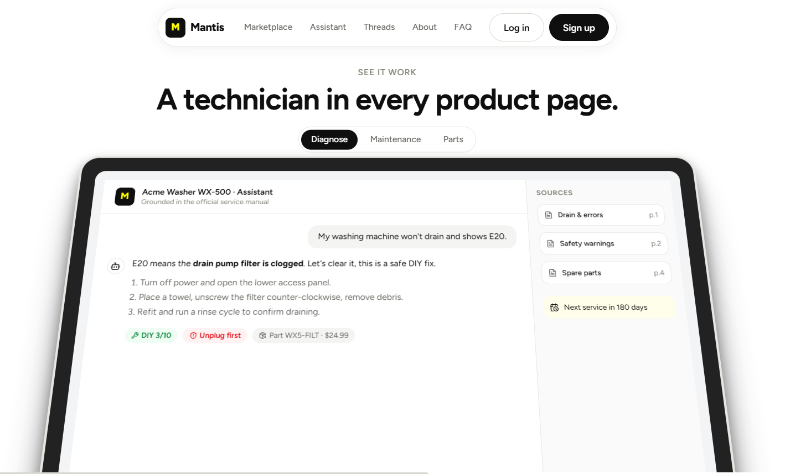
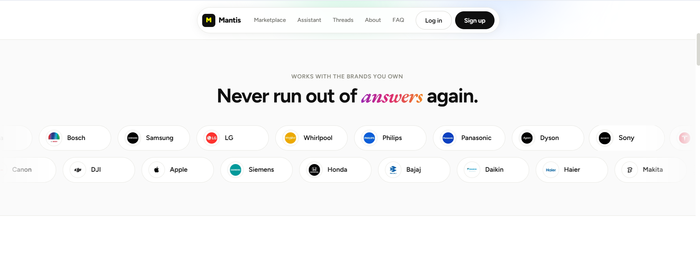
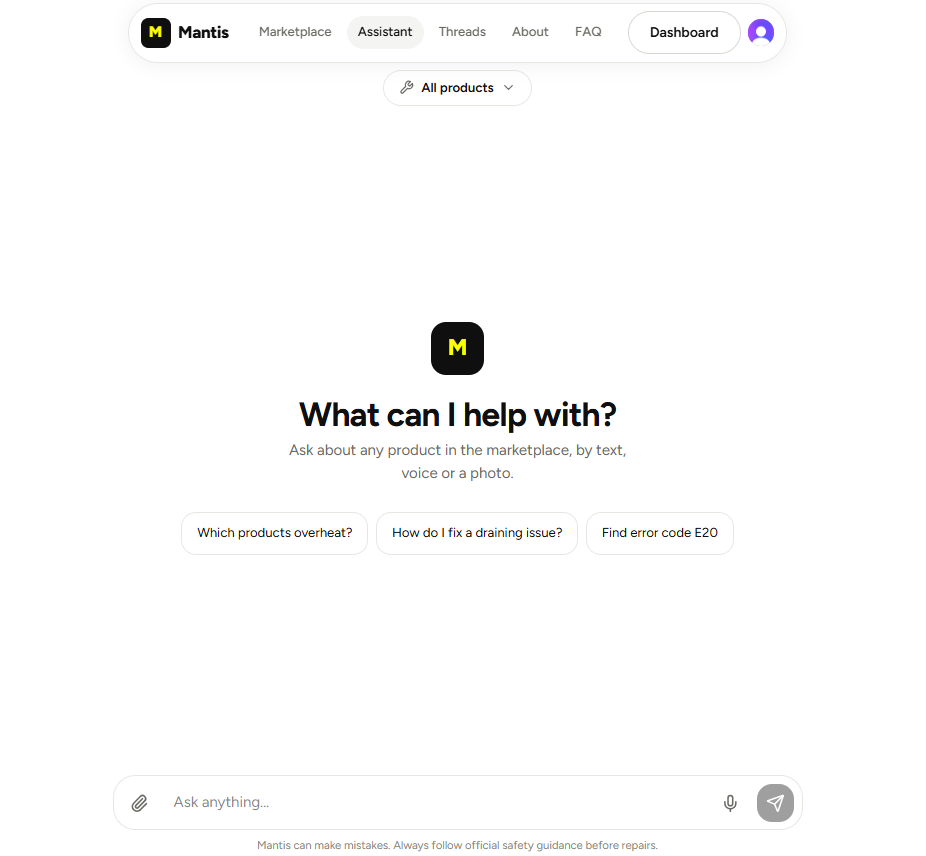
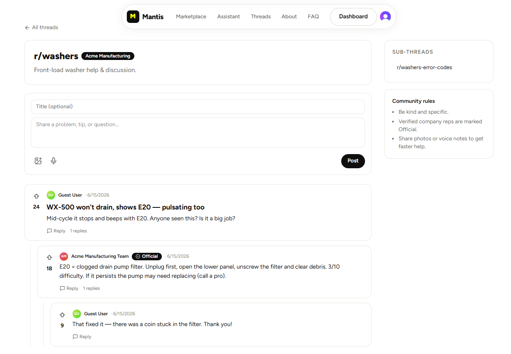
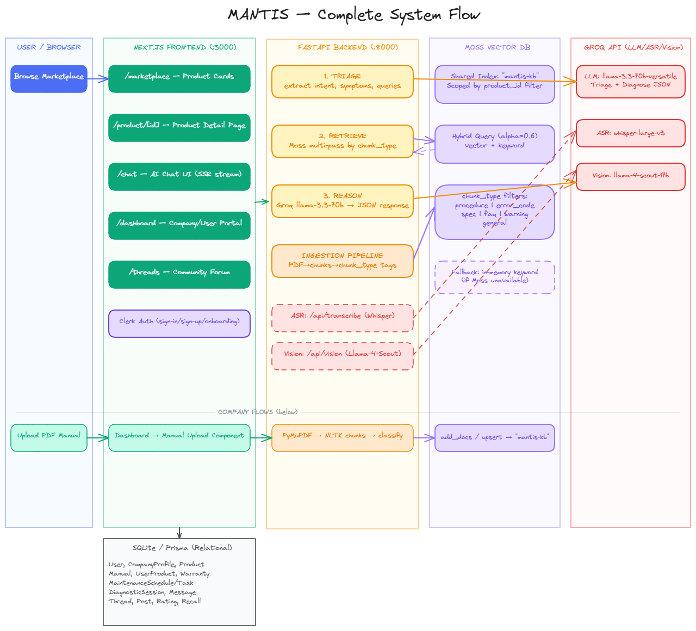

<div align="center">

<br/>

```
███╗   ███╗ █████╗ ███╗   ██╗████████╗██╗███████╗
████╗ ████║██╔══██╗████╗  ██║╚══██╔══╝██║██╔════╝
██╔████╔██║███████║██╔██╗ ██║   ██║   ██║███████╗
██║╚██╔╝██║██╔══██║██║╚██╗██║   ██║   ██║╚════██║
██║ ╚═╝ ██║██║  ██║██║ ╚████║   ██║   ██║███████║
╚═╝     ╚═╝╚═╝  ╚═╝╚═╝  ╚═══╝   ╚═╝   ╚═╝╚══════╝
```

### **Assistant for Your Products**
*24-Hour Hackathon*

<br/>

[]()
[]()

<br/>

---

</div>

## Overview

**Mantis** is an intelligent, unified platform designed to bridge the gap between complex product manuals and everyday users. Instead of sifting through hundreds of PDF pages or watching hours of scattered YouTube videos, users can talk to an AI-powered technician specifically trained on the manufacturer's official documentation.

What makes Mantis special isn't just its search capability—it's the **systematic, diagnostic reasoning**. Just like a real technician, the Mantis Assistant asks clarifying questions to eliminate unlikely causes, guides users through safe inspection steps, and provides cited, step-by-step corrective actions.

## What Makes Mantis Special?

### Intelligent Diagnostic Assistant
Traditional chatbots just dump search results. Mantis acts as a virtual repair technician. If a user says "my scooter horn is broken", the assistant doesn't just list twenty possible causes. It asks targeted follow-up questions (e.g., "Does the headlight work? Did the issue start suddenly?") to narrow down the exact failure point before providing a solution, complete with safety warnings and difficulty scores.

### Hybrid Architecture (Avoiding MOSS Limits)
During the hackathon, we encountered rate limits and token constraints with the MOSS API. To solve this, we designed a **Hybrid Reasoning Architecture**:
- **MOSS API** is used strictly as a highly-specialized retrieval engine. It vectorizes manuals and intelligently fetches relevant chunks (symptoms, procedures, error codes, and warnings).
- **Groq (Llama-3.3-70b)** takes over the heavy lifting of generative reasoning. It triages user intents, formulates queries, and synthesizes the final conversational response.

This decoupled approach allows us to deliver blazing-fast responses while completely avoiding MOSS token limits!

### Secure Auth via Clerk
User authentication, sign-ups, and sessions are fully secured using **Clerk**. Whether it's a company uploading a product or a user registering their appliances, data is handled securely and effortlessly.

### Product Marketplace & Dashboard
Companies can register and list their products, complete with manuals and images. Users get a personalized dashboard where they can "own" products, track maintenance schedules, and access all relevant information instantly.

### Reviews & Ratings
Users can rate products and leave detailed reviews, building a trusted ecosystem for prospective buyers to evaluate appliances and electronics.

### Community Threads
Every product has dedicated community threads. Users can start discussions, share their own DIY fixes, ask questions to other owners, and upvote helpful solutions.

---

## Screenshots

<div align="center">
  
  <br/><br/>
  
  <br/><br/>
  
  <br/><br/>
  
</div>

## Application Flow

Here is how data and users flow through Mantis:

<div align="center">
  
</div>

## Backend Architecture

Our backend separates triage, retrieval, and reasoning to ensure speed and accuracy:

<div align="center">
  
</div>

## Tech Stack

- **Frontend:** Next.js 15, React, TailwindCSS, Clerk (Auth)
- **Backend:** FastAPI (Python), Groq (Llama-3.3), MOSS API
- **Database:** Prisma ORM with SQLite
- **Design:** Excalidraw, Radix UI

## Getting Started

### Prerequisites
- Node.js & npm
- Python 3.10+
- Clerk API Keys
- Groq API Key
- MOSS API Key

### Frontend Setup

```bash
cd frontend
npm install
npx prisma db push
npm run dev
```

### Backend Setup

```bash
cd backend
python -m venv .venv
# Activate venv
# Windows: .venv\Scripts\activate | Mac/Linux: source .venv/bin/activate
pip install -r requirements.txt
python -m app.main
```

<div align="center">
<br/>
<em>Built with passion in 24 hours.</em>
</div>
